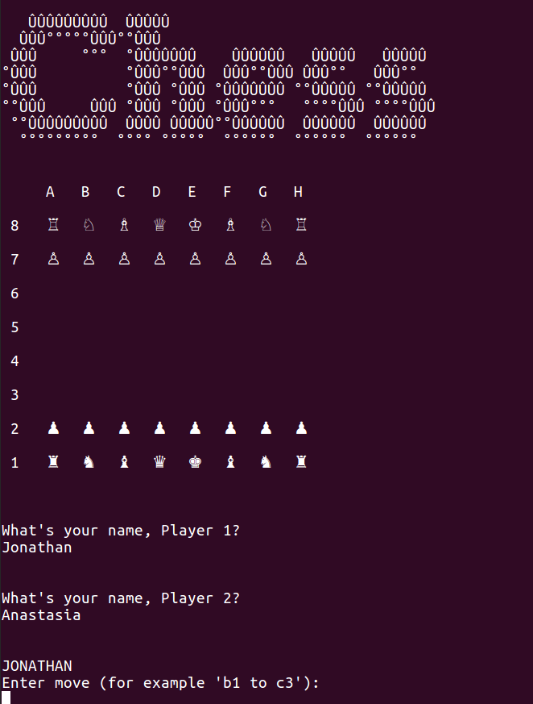

# Chess

This is a terminal game of chess for two players, written in Ruby.

It enforces all the rules of chess (including tricky ones like castling, en passant and pawn promotion), and includes fairly comprehensive test coverage (over a hundred individual tests).

It's the final project of the Ruby section of [The Odin Project](https://www.theodinproject.com/courses/ruby-programming/lessons/ruby-final-project).



## Installation

Open your terminal/command line. Navigate to the directory where you want this project to live. Type:
```
$ git clone https://github.com/Jonosenior/chess.git
$ cd chess
$ ruby lib/game.rb
```

## Game Structure
### Classes
  * **Game**: Runs the basic game structure - start new turn, review turn etc.
  * **Board**: Enforces the rules of chess and stores current status of the board.
  * **Pieces**: Each piece knows its own location, colour, and possible moves (on an empty board).
  * **Player**: Stores the player name, colour, and asks the user for any input.
  * **Text**: Stores any print statements too large for the other classes.

## Thoughts

  * Discussing the project beforehand with fellow Odinite IvyMic helped me realise that the pieces don't literally have to move, but rather a new object of the same class with the same properties can be instantiated on the target square, and the original piece deleted. (As a sidenote, this reminded me of the philosophical sci-fi question of whether the person who steps out the other side of a teleporter is the same person who stepped in, or whether they original person died and a clone was born. In my game, it's a clone...).

  * Inheritance vs composition for the pieces. I understand that composition is favoured by many developers, but both IvyMic and I decided that inheritance was more suited to this project, because we're unlikely to fiddle around with the parent Piece class (which will never be instantiated) and because we the project is limited and the pieces are not subject to change in the future.

  * I did however use composition to create the queen's moveset, by combining the movesets from the bishop and the rook.

  * Testing. This was the most comprehensive testing that I've had to do, and I found myself in a good workflow of creating a new feature, then testing it extensively before moving on to the next feature. I've tried to follow Sandi Metz's advice in POODR to test only the public interface (eg test #valid_move? method directly, rather than its various helpers). I understand that the use of multiple nested 'context' blocks is normally frowned upon in Rspec, but it seemed unavoidable when trying to thoroughly examine multiple possible scenarios in a game of chess.

  * Similarly, I'm aware that some of my code breaks normal convention - for instance the #valid_move? method in Board is quite long at 14 lines, and is almost entirely comprised of 'return false if...' statements, which looks quite ugly. But I couldn't see a way around this, and the clarity of having every a single method evaluate every condition of a valid move is very useful.

  * Repetition. I was worried that certain parts of my code weren't DRY enough, specifically the four or so methods that iterate over every piece on the board, and the helper methods for the Bishop's moveset, and asked for help at the amazing Open Tech School Ruby Co-Learning group in Berlin. They advised me that the repetition wasn't extreme, and that any solution would drastically reduce readability, so it wasn't worth refactoring.

  * My code was so elegant before I had to account for all the unsual moves... It was painful to see my straightforward code marred by the ugliness of 'if class == Pawn then...' statements, but this was unavoidable. Pawn's unusual moveset, en passant, promotion, castling - these all added extra complications which I had to account for.

  * I used pry for the first time to debug, which was very useful as chess is my most complicated project to date, and my old tactic of placing 'puts' statments all over the place was getting unwieldy.

  * A very cool experience was plugging in stalemate and checkmate examples from chess websites as rspec test situations, and seeing my chess program correctly diagnose them.

## Todo

  * Add a save game function with file serialisation using JSON. I've done this for previous projects, but for now I'm a bit chessed-out and it's onward to the Rails section of the Odin curriculum.
